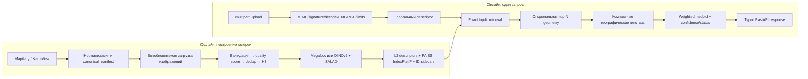

# Архитектура GeoSnap

Актуально на 2026-08-15. Этот документ описывает реализованную архитектуру,
а не целевую точность продукта. Текущий объём уличной московской галереи
недостаточен для заявления о покрытии Москвы или для калибровки уверенности.

## Принцип

GeoSnap — модульный монолит с retrieval-based локализацией. Нейросеть не
регрессирует широту и долготу напрямую: она строит глобальный визуальный
дескриптор, а координата получается только из геопривязанных записей галереи.
`moscow` — значение данных `city_id`, а не условие внутри общего алгоритма.

## Границы модулей

| Область | Реализация | Ответственность и граница |
|---|---|---|
| Ingestion | [`ml/ingestion`](../ml/ingestion) | Сетевые API, bbox/grid, пагинация, checkpoint/retry, нормализация источников, скачивание. Не загружает ML-модель. |
| Cleaning | [`ml/cleaning`](../ml/cleaning) | Консервативная проверка файлов и координат, quality score, exact/perceptual dedup, финальный Parquet и отчёты. Не обслуживает HTTP. |
| Геообогащение | [`ml/enrichment`](../ml/enrichment) | H3-поля для анализа, бакетизации и будущего шардирования. H3 не является обязательным онлайн-префильтром. |
| Retrieval | [`ml/retrieval`](../ml/retrieval) | Общий `BaseRetriever`, официальные checkpoint-backed адаптеры, пакетные и возобновляемые embedding jobs. Ошибка загрузки весов не заменяется случайной моделью. |
| Indexing | [`ml/indexing`](../ml/indexing) | Нормализованный exact `faiss.IndexFlatIP`, явное отображение row → stable reference ID, сохранение и проверка sidecar-метаданных. На macOS FAISS может исполняться в отдельном процессе. |
| Verification | [`ml/verification`](../ml/verification) | Ограниченная top-N локальная геометрия и rerank. По умолчанию выключена; подробности и измерения — в [отчёте о verification](verification_report.md). |
| Localization | [`ml/localization`](../ml/localization) | Пространственная группировка, выбор одной моды, оценка координаты, интерпретируемая уверенность и статусы `ok`/`low_confidence`/`out_of_coverage`. Не зависит от FastAPI. |
| Backend | [`apps/backend/app`](../apps/backend/app) | HTTP trust boundary, lifecycle, типизированные схемы, ограничения upload, readiness, безопасные ошибки и thumbnail по непрозрачному ID. ML загружается один раз в lifespan. |
| Frontend | [`apps/frontend`](../apps/frontend) | Минимальный клиент: upload, состояния результата, карта, гипотезы, совпадения и атрибуция. Не содержит логики локализации. |

PostgreSQL/PostGIS остаётся опциональным хранилищем метаданных и будущих
геозапросов. Дескрипторы и FAISS-индекс намеренно не помещаются в PostgreSQL:
канонические таблицы хранятся в Parquet, изображения — в файловом слое,
дескрипторы — в NumPy, индекс и его отображения — отдельными файлами.

## Канонический reference manifest

Контракт определён в [`ml/ingestion/schema.py`](../ml/ingestion/schema.py).
`id` не зависит от позиции строки: это детерминированный UUIDv5 от
`source:source_image_id`. Все сохраняемые стадии обязаны сохранить требуемые
поля даже при нулевом результате.

| Поле | Представление | Назначение |
|---|---|---|
| `id` | непустая строка, уникальная | Стабильный внутренний reference ID. |
| `city_id` | строка | Область данных, сейчас `moscow`; позволяет добавить другие индексы. |
| `source` | строка | Источник записи; для текущей deployable gallery — `mapillary` или `kartaview`. |
| `source_image_id` | строка | Стабильный ID изображения у источника. |
| `sequence_id` | nullable string | Последовательность/трек для dedup и leakage-контроля. |
| `image_path` | строка | Локальный путь внутри offline/runtime storage; не выдаётся API. |
| `lat`, `lon` | конечные числа | Координата reference; проверяется по мировым границам, для `moscow` также по настроенному bbox. |
| `captured_at` | nullable UTC ISO-8601 string | Время съёмки после нормализации. |
| `heading` | nullable float `[0, 360)` | Направление камеры, если источник его предоставил. |
| `quality_score` | nullable float | Аналитический приоритет/выбор лучшего дубля, не доказательство пригодности сцены. |
| `license` | строка | Лицензия конкретного источника. |
| `attribution` | строка | Текст, который должен сопровождать показ reference. |
| `source_url` | строка | Ссылка на исходную запись/трек. |
| `metadata_json` | JSON-строка | Детерминированно сериализованный JSON-текст; dict и литерал `"{}"` не смешиваются. |

`download_url` — служебное поле pipeline и не часть публичного reference
контракта. После обработки добавляются `width`, `height`, `blur_score`,
`brightness`, `exposure_score`, `h3_coarse` и `h3_fine`. Значения H3 — только
индексные масштабы, не названия «район» или «улица».

## Офлайн-путь данных

1. Mapillary и KartaView пишут исходные нормализованные JSON, schema-v2
   checkpoint с config fingerprint, append-only journal и cumulative/last-run
   статистику. `MAPILLARY_ACCESS_TOKEN` читается только из окружения; без него
   loader завершается с понятной ошибкой, не блокируя KartaView orchestration.
2. Источники объединяются в один schema-validated Parquet. Downloader читает
   его Arrow-батчами, держит не более `2 × workers` pending tasks, разрешает
   только HTTPS и source-specific hosts и вручную валидирует каждый redirect.
   Повторный запуск безопасен благодаря stable ID, checkpoint и повторной
   проверке уже существующих файлов.
3. Hard validation удаляет только отсутствующие/нечитаемые файлы,
   недопустимые координаты и явно непригодные размеры/форматы.
4. Quality stage вычисляет резкость, разрешение и экспозицию. Hard blur filter
   по умолчанию равен нулю, поэтому score преимущественно служит анализу и
   выбору дубля.
5. Dedup сначала сравнивает SHA-256, затем локально индексированный pHash.
   Кандидаты ограничиваются пространством, heading, sequence и временем;
   winner выбирается quality-first. Нет глобального O(N²) сравнения и нет
   географического per-location cap, который удалял бы разные виды.
6. H3 resolution 6/9 добавляется для статистики. Финальный manifest снова
   валидируется, а отчёт строит source/coverage графики и nearest-reference
   статистику только когда она определима.
7. Embedding job загружает модель один раз, работает батчами, сохраняет
   immutable chunks/checkpoint и финализирует `descriptors.npy` через memmap без
   полной конкатенации в RAM. Input signature хеширует сами image bytes, а
   schema-v2 metadata связывает generation и SHA-256 каждого артефакта.
   Результат:
   `descriptors.npy`, `id_mapping.json`, `reference_metadata.jsonl`,
   `build_metadata.json`, `failures.jsonl`.
8. Индексатор проверяет размерность, finite/L2-инварианты и mapping, строит
   correctness-first `IndexFlatIP` и сохраняет `index.faiss` вместе с mapping,
   reference metadata и schema-v2 build metadata. Loader сверяет generation,
   размеры, counts и SHA-256 sidecars и закрывается fail-safe при drift.

## Онлайн-путь и fail-safe поведение

FastAPI lifespan создаёт один `LocalizationService`, один retriever и один
индекс на процесс. `/health` проверяет только живость процесса. `/ready`
раздельно сообщает готовность модели, индекса, reference metadata и, если это
явно включено, базы данных. `/localize` принимает ровно одно multipart-поле
`image` формата JPEG/PNG/WebP и проверяет размер тела, MIME, magic signature,
расширение, decode, decompression limits, dimensions, animation, EXIF
orientation и RGB conversion.

После exact top-K search опциональный verifier может переставить только
ограниченную голову списка. Затем локализатор:

- формирует кластеры вокруг сильных anchors и проверяет расстояние до каждого
  члена, поэтому single-link цепочка не объединяет далёкие точки;
- не смешивает разные `city_id`/`index_id` и не усредняет разные моды;
- по умолчанию использует weighted geographic medoid сильнейшего компактного
  кластера;
- строит confidence из similarity, географического margin, cluster mass,
  compactness, separation и лёгкой query-quality диагностики;
- возвращает `low_confidence` или `out_of_coverage`, когда evidence слабое;
- оставляет `uncertainty_radius_m = null`, пока нет отдельной калибровки на
  leakage-resistant московском наборе.

Текущая confidence-функция помечена `interpretable-v1-uncalibrated`.
Пороговые значения являются инженерными defaults, а не подтверждённой
вероятностью правильного ответа.

API не возвращает абсолютные пути, download URL, токены или stack traces.
Thumbnail разрешается сервером по `reference_id` из доверенного index sidecar;
атрибуция возвращается для каждого отображаемого совпадения. Полный перечень
лицензий и ограничений находится в [лицензионном аудите](licenses.md).

## Фактически проверенные модели

Оба production adapter были загружены из официальных pinned checkpoint и
реально выполнены на Apple M1 Pro/MPS. Помимо execution smokes, они прошли один
и тот же content-pinned Moscow Commons proxy (12 gallery / 8 query). Это всё
ещё tiny landmark-biased, non-street-view оценка, а не production accuracy.

| Adapter | Закреплённые ревизии | Descriptor | Proxy R@1/5/10 | Median offline query |
|---|---|---:|---:|---:|
| MegaLoc | repo `5fe0dd697c4a70ba3e23607f6716ab3c606b16db`; checkpoint `37bb43d65dd6388d1578052de5eb0bcdceb497e7` | 8 448, finite, L2 | 87.5/100/100% | 72.78 ms |
| DINOv2 + SALAD | SALAD `6aede13a3f6c25750bf7fde10209c06cb73060bb`; DINOv2 `7764ea0f912e53c92e82eb78a2a1631e92725fc8` | 8 448, finite, L2 | 87.5/100/100% | 70.65 ms |

В конфигурации sample/API инженерным default остаётся `RETRIEVER=megaloc`.
Это не заявление, что MegaLoc точнее: имеющийся landmark-biased Commons proxy
не заменяет репрезентативный cross-sequence/cross-time Moscow street-view
benchmark и сам по себе не может выбрать production retriever.

## Текущие границы готовности

- Реальный однокадровый Moscow KartaView pipeline, MegaLoc embedding и
  однострочный FAISS index сохранены и проверяют связность стадий, но не
  retrieval accuracy и не покрытие города; числа приведены в
  [отчёте о данных](data_report.md).
- Live Mapillary ingestion не выполнялся без пользовательского access token.
- Более широкий KartaView probe показал sparse/нестабильный ответ API и только
  три финально пригодных изображения в одной ячейке контрольной сетки.
- OpenCV SIFT verification на том же proxy не изменила Recall/top-1, снизила
  answer rate с 75% до 12.5% и добавила около 631 ms median offline latency;
  она остаётся opt-in/default-off.
- Уверенность и радиус неопределённости нельзя считать калиброванными до
  появления достаточной leakage-resistant street-view оценки.
