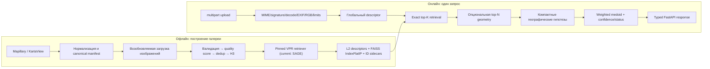

# Архитектура GeoSnap

Актуально на 2026-09-03. Этот документ описывает реализованную архитектуру и
границы данных, а не обещанную точность продукта. Production gallery имеет
реальные Mapillary/KartaView references, но измеренное покрытие остаётся
частичным. Current frozen v3 selection — SAGE ViT-B, exact `IndexFlatIP`, K=30,
single query, density-aware geographic mode voting, weighted medoid,
verification off и calibrated logistic threshold `0.9349250249145314`.
Результаты и ограничения — в
[phase2_5_product_recovery.md](phase2_5_product_recovery.md).

## Граница production данных

Единственный допустимый вход в deployable Moscow reference gallery —
физически сохранённые изображения Mapillary и KartaView. Перед cleaning
применяется exact OSM administrative AOI: relation `102269`, `MultiPolygon` из
10 компонентов, SHA-256
`33b5dbf852cb94e5292e7848974fba78641dd76339cad142e73b7419b5db4a8a`.

V2 exact-AOI source manifest содержит 23 654 references (17 143 Mapillary,
6 511 KartaView); frozen v3 leakage-resistant gallery/index содержит 20 031
(14 972 / 5 059). В fixed 20×20 grid заняты 93 cells, только 30 dense-healthy,
поэтому `city_id=moscow` обозначает область данных, а не гарантию локализации в
любой точке города.

MSLS, Wikimedia Commons и любые другие benchmark/training datasets разрешены
только в research/evaluation workflow. Они не могут быть объединены с
canonical manifest, embedded в production descriptors или добавлены в Moscow
FAISS index.

## Принцип

GeoSnap — модульный монолит с retrieval-based локализацией. Нейросеть не
регрессирует широту и долготу напрямую: она строит глобальный визуальный
дескриптор, а координата получается только из геопривязанных записей галереи.
`moscow` — значение данных `city_id`, а не условие внутри общего алгоритма.

## Границы модулей

| Область | Реализация | Ответственность и граница |
|---|---|---|
| Ingestion | [`ml/ingestion`](../ml/ingestion) | Сетевые API, bbox/grid, пагинация, checkpoint/retry, нормализация источников, скачивание. Не загружает ML-модель. |
| Cleaning | [`ml/cleaning`](../ml/cleaning) | Консервативная проверка файлов и координат, quality score, exact/perceptual dedup, финальный Parquet и отчёты. Не обслуживает HTTP. |
| Геообогащение | [`ml/enrichment`](../ml/enrichment) | H3-поля для анализа, бакетизации и будущего шардирования. H3 не является обязательным онлайн-префильтром. |
| Retrieval | [`ml/retrieval`](../ml/retrieval) | Общий `BaseRetriever`, официальные checkpoint-backed адаптеры, пакетные и возобновляемые embedding jobs. Ошибка загрузки весов не заменяется случайной моделью. |
| Indexing | [`ml/indexing`](../ml/indexing) | Нормализованный exact `faiss.IndexFlatIP`, явное отображение row → stable reference ID, сохранение и проверка sidecar-метаданных. На macOS FAISS может исполняться в отдельном процессе. |
| Verification | [`ml/verification`](../ml/verification) | Ограниченная top-N локальная геометрия и rerank. По умолчанию выключена; подробности и измерения — в [отчёте о verification](verification_report.md). |
| Localization | [`ml/localization`](../ml/localization) | Пространственная группировка, выбор одной моды, оценка координаты, интерпретируемая уверенность и статусы `ok`/`low_confidence`/`out_of_coverage`. Не зависит от FastAPI. |
| Backend | [`apps/backend/app`](../apps/backend/app) | HTTP trust boundary, lifecycle, типизированные схемы, ограничения upload, readiness, безопасные ошибки и thumbnail по непрозрачному ID. ML загружается один раз в lifespan. |
| Frontend | [`apps/frontend`](../apps/frontend) | Минимальный клиент: upload, состояния результата, карта, гипотезы, совпадения и атрибуция. Не содержит логики локализации. |

PostgreSQL/PostGIS остаётся опциональным хранилищем метаданных и будущих
геозапросов. Дескрипторы и FAISS-индекс намеренно не помещаются в PostgreSQL:
канонические таблицы хранятся в Parquet, изображения — в файловом слое,
дескрипторы — в NumPy, индекс и его отображения — отдельными файлами.

## Канонический reference manifest

Контракт определён в [`ml/ingestion/schema.py`](../ml/ingestion/schema.py).
`id` не зависит от позиции строки: это детерминированный UUIDv5 от
`source:source_image_id`. Все сохраняемые стадии обязаны сохранить требуемые
поля даже при нулевом результате.

| Поле | Представление | Назначение |
|---|---|---|
| `id` | непустая строка, уникальная | Стабильный внутренний reference ID. |
| `city_id` | строка | Область данных, сейчас `moscow`; позволяет добавить другие индексы. |
| `source` | строка | Источник записи; для текущей deployable gallery — `mapillary` или `kartaview`. |
| `source_image_id` | строка | Стабильный ID изображения у источника. |
| `sequence_id` | nullable string | Последовательность/трек для dedup и leakage-контроля. |
| `image_path` | строка | Локальный путь внутри offline/runtime storage; не выдаётся API. |
| `lat`, `lon` | конечные числа | Координата reference; проверяется по мировым границам, для `moscow` также по настроенному bbox. |
| `captured_at` | nullable UTC ISO-8601 string | Время съёмки после нормализации. |
| `heading` | nullable float `[0, 360)` | Направление камеры, если источник его предоставил. |
| `quality_score` | nullable float | Аналитический приоритет/выбор лучшего дубля, не доказательство пригодности сцены. |
| `license` | строка | Лицензия конкретного источника. |
| `attribution` | строка | Текст, который должен сопровождать показ reference. |
| `source_url` | строка | Ссылка на исходную запись/трек. |
| `metadata_json` | JSON-строка | Детерминированно сериализованный JSON-текст; dict и литерал `"{}"` не смешиваются. |

`download_url` — служебное поле pipeline и не часть публичного reference
контракта. После обработки добавляются `width`, `height`, `blur_score`,
`brightness`, `exposure_score`, `h3_coarse` и `h3_fine`. Значения H3 — только
индексные масштабы, не названия «район» или «улица».

## Офлайн-путь данных

1. Mapillary и KartaView пишут исходные нормализованные JSON, schema-v2
   checkpoint с config fingerprint, append-only journal и cumulative/last-run
   статистику. `MAPILLARY_ACCESS_TOKEN` читается только из окружения; без него
   loader завершается с понятной ошибкой, не блокируя KartaView orchestration.
2. Источники объединяются в один schema-validated Parquet. Downloader читает
   его Arrow-батчами, держит не более `2 × workers` pending tasks, разрешает
   только HTTPS и source-specific hosts и вручную валидирует каждый redirect.
   Повторный запуск безопасен благодаря stable ID, checkpoint и повторной
   проверке уже существующих файлов.
3. Hard validation удаляет только отсутствующие/нечитаемые файлы,
   недопустимые координаты и явно непригодные размеры/форматы.
4. Quality stage вычисляет резкость, разрешение и экспозицию. Hard blur filter
   по умолчанию равен нулю, поэтому score преимущественно служит анализу и
   выбору дубля.
5. Dedup сначала сравнивает SHA-256, затем локально индексированный pHash.
   Кандидаты ограничиваются пространством, heading, sequence и временем;
   winner выбирается quality-first. Нет глобального O(N²) сравнения и нет
   географического per-location cap, который удалял бы разные виды.
6. H3 resolution 6/9 добавляется для статистики. Финальный manifest снова
   валидируется, а отчёт строит source/coverage графики и nearest-reference
   статистику только когда она определима.
7. Embedding job загружает модель один раз, работает батчами, сохраняет
   immutable chunks/checkpoint и финализирует `descriptors.npy` через memmap без
   полной конкатенации в RAM. Input signature хеширует сами image bytes, а
   schema-v2 metadata связывает generation и SHA-256 каждого артефакта.
   Результат:
   `descriptors.npy`, `id_mapping.json`, `reference_metadata.jsonl`,
   `build_metadata.json`, `failures.jsonl`.
8. Индексатор проверяет размерность, finite/L2-инварианты и mapping, строит
   correctness-first `IndexFlatIP` и сохраняет `index.faiss` вместе с mapping,
   reference metadata и schema-v2 build metadata. Loader сверяет generation,
   размеры, counts и SHA-256 sidecars и закрывается fail-safe при drift.

## Онлайн-путь и fail-safe поведение

FastAPI lifespan создаёт один `LocalizationService`, один retriever и один
индекс на процесс. `/health` проверяет только живость процесса. `/ready`
раздельно сообщает готовность модели, индекса, reference metadata и, если это
явно включено, базы данных. `/localize` принимает ровно одно multipart-поле
`image` формата JPEG/PNG/WebP и проверяет размер тела, MIME, magic signature,
расширение, decode, decompression limits, dimensions, animation, EXIF
orientation и RGB conversion.

После exact top-K search опциональный verifier может переставить только
ограниченную голову списка. Затем локализатор:

- формирует кластеры вокруг сильных anchors и проверяет расстояние до каждого
  члена, поэтому single-link цепочка не объединяет далёкие точки;
- не смешивает разные `city_id`/`index_id` и не усредняет разные моды;
- выбирает географическую моду с rank-, sequence-, provider-, density- и
  compactness-aware evidence, затем использует weighted medoid;
- строит calibrated logistic confidence из 14 интерпретируемых retrieval и
  localization признаков без raw pixels;
- возвращает `low_confidence` или `out_of_coverage`, когда evidence слабое;
- оставляет `uncertainty_radius_m = null`, пока нет отдельной калибровки на
  leakage-resistant московском наборе.

V3 confidence model fit только на development с group cross-validation;
threshold выбран только на независимой calibration. Wilson interval остаётся
reported evidence, а не kill-switch. Service загружает
`configs/moscow_real_v3_frozen.json`, проверяет confidence/index hashes и
отвергает конфликтующие model/K/localizer/index values.
`uncertainty_radius_m` остаётся `null`.

API не возвращает абсолютные пути, download URL, токены или stack traces.
Thumbnail разрешается сервером по `reference_id` из доверенного index sidecar;
атрибуция возвращается для каждого отображаемого совпадения. Полный перечень
лицензий и ограничений находится в [лицензионном аудите](licenses.md).

## Модели и protocol выбора

MegaLoc, DINOv2+SALAD, SAGE и SelaVPR++ имеют pinned checkpoint-backed
adapters. SALAD остаётся evaluation-only из-за GPL/checkpoint uncertainty.
SelaVPR++ base и официальный two-stage reranker были проверены, но дали меньшую
calibration product utility; CricaVPR отклонён из-за batch-dependent descriptor
contract. Frozen selection — single-query SAGE ViT-B. Это не утверждение о
превосходстве в других городах. Лицензии описаны в [licenses.md](licenses.md).

Production retriever выбирается только следующим порядком:

1. V3 публикует disjoint Mapillary/KartaView gallery/development/calibration/test
   manifests с sequence, ID/source-ID, SHA-256, pHash и geographic embargo.
2. Retriever, K, aggregation и confidence выбираются на development; final
   confidence coefficients fit на development, threshold — на calibration.
3. Model/checkpoint, K, aggregation, threshold, confidence artifact и index
   hashes связываются в tracked frozen runtime config.
4. V3 held-out test открыт ровно один раз после freeze; следующая tuning
   iteration требует нового sealed namespace.
5. Host smoke проверяет тот же frozen SAGE index/runtime contract.

Commons proxy и MSLS-derived benchmarks не могут выбрать production model:
первый — hand-curated landmark-biased proxy, второй — внешний benchmark/training
corpus, а оба не являются Mapillary/KartaView Moscow deployment data.

## Текущие границы готовности

- V2 source содержит 23 654, frozen v3 gallery/index — 20 031 references;
  подробности — в [Part 2.5 отчёте](phase2_5_product_recovery.md).
- V3 split содержит 602 development, 603 calibration и 1 195 once-opened test
  queries. Он не
  означает full-city coverage: заняты 93/400 cells, dense-healthy только 30.
- Frozen test answer rate равен 7,70% при 94,57% conditional <=100 м, но три
  accepted errors >500 м не проходят preferred <=1% catastrophic target.
- OpenCV SIFT/LightGlue-compatible verification остаётся optional/default-off:
  real 100-query ablation дала нулевой all-query accuracy gain и median
  overhead +1 002 мс. Evidence и ограничения — в
  [verification_report.md](verification_report.md).
- `uncertainty_radius_m` нельзя считать калиброванным только из confidence
  threshold; оно остаётся `null`, пока не появится отдельная проверенная
  uncertainty calibration.
- Docker Compose configuration проверена статически; stale 17,5 GB image не
  содержит новую locked dependency и не был перестроен. Clean slim rebuild и
  публичная browser QA остаются в Part 3.
